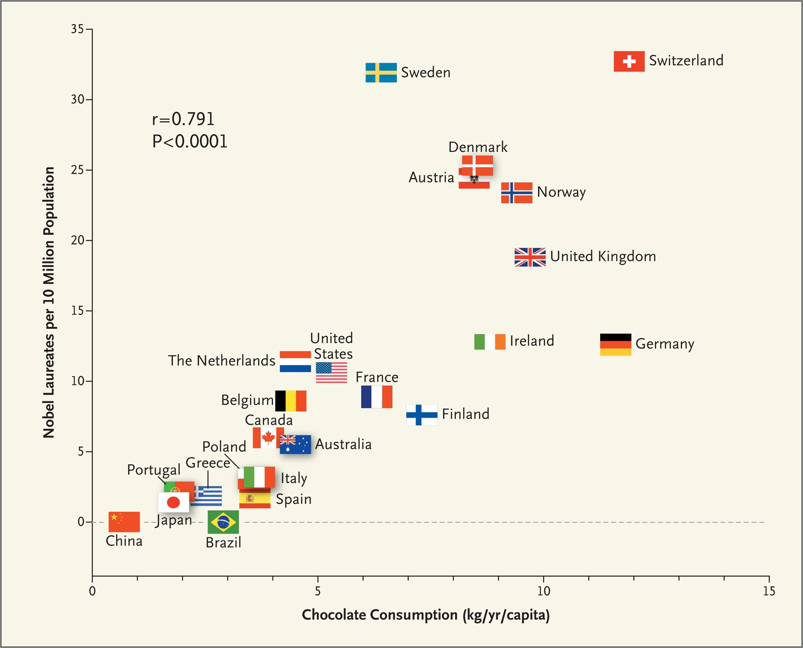

#### Question 1

The article [@messerli2012], published in a top medical journal (the New England Journal of Medicine), studied the relationship between per capita chocolate consumption and per capita Nobel prizes. The relationship is shown in a graph on the last page. Countries with higher chocolate consumption also tend to have more Nobel prizes. The author wrote that since dietary flavanols in chocolate have been shown to improve blood circulation in the brain, it might improve cognitive function and result in more excellent research, leading to more Nobel prizes.

##### Do you find the study convincing? Explain why or why not. Use the terms/concepts we've discussed in class. (2-3 sentences)

\ 

\ 

\ 

#### Question 2

- We write $\mathbf x$ (bold, lower case) to refer to the list $x_1, x_2, \ldots, x_n$ of $n$ observations of the variable $x$.
- For a single number denoted $c$, we write $c \mathbf x$ for the list $cx_1, cx_2, \ldots, cx_n$.
- In words, each element of $\mathbf x$ gets multiplied by $c$, forming a new list. We might say this is *scaled by a factor of $c$*.
- Remember that "$\sum_{i=1}^n \text{something involving } i$" just means to add up the expression "something involving $i$" for all values of $i$ starting at 1 and ending at $n$.
- For example, $\sum_{i=1}^3 2(i-1)^2 = 2(0)^2 + 2(1)^2 + 2(2)^2 = 10$.

##### (a) Remembering that $\bar x = \frac{1}{n} \sum_{i=1}^n x_i$ is the mean of $\mathbf x$, what is the mean of $c \mathbf x$? Show your work.

\ 

\ 

##### (b) Remembering that $s = \sqrt{\frac{1}{n-1}\sum_{i=1}^n(x_i - \bar x)^2}$ is the standard deviation (SD) of $\mathbf x$, what is the SD of $c \mathbf x$? Show your work.

\ 

\ 
 
##### (b) For the list $\mathbf x = -1, 0, 1$, and $c = -10$, compute the means and SDs of both $\mathbf x$ and $c\mathbf x$ and check your answers to the previous two parts.

\ 

### References

